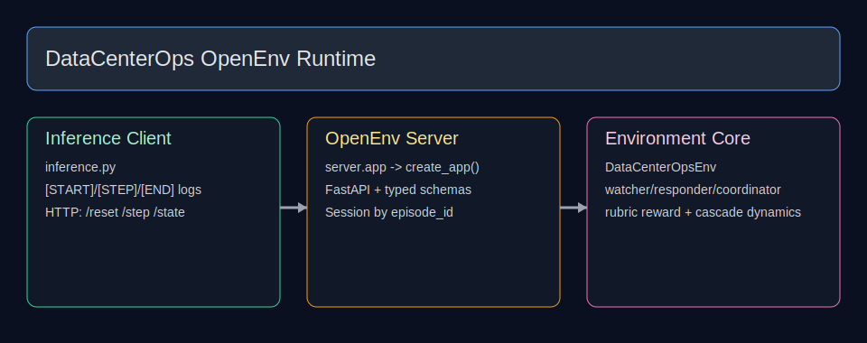

# DataCenterOps OpenEnv Environment

This repository provides a typed OpenEnv-compatible RL environment for data-center incident response.

It is designed to be **deployment-safe first** (API contract, inference stability, pre-validation), then score-oriented.



## What is verified (factual)

The following have been validated in this repo:

- FastAPI server startup using `uvicorn server.app:app --host 0.0.0.0 --port 7860`
- Endpoints:
  - `GET /health`
  - `POST /reset`
  - `POST /step` → `{observation, reward, terminated, truncated, info}`
  - `GET /state`
- `inference.py` runs end-to-end against remote API (`ENV_BASE_URL`) with strict `[START]/[STEP]/[END]` output format
- `pre_validation.py` checks files/imports and runs a live API episode simulation

## Environment interface

Core environment class: `environment.DataCenterOpsEnv`

- `reset(seed=..., task_tier=...) -> DataCenterObservation`
- `step(action) -> (observation, reward, terminated, truncated, info)`
- `state() -> DataCenterState`

Server adapter: `server.datacenter_environment.DataCenterEnvironment`

## Tasks

Defined tiers:

- `easy`  (24 max steps)
- `medium` (42 max steps)
- `hard` (60 max steps)

Task metadata is in:

- `openenv.yaml`
- `grader.py` (`TASK_DEFINITIONS`)

## Quick start

### 1) Install dependencies

```bash
pip install -r requirements.txt
```

### 2) Run server

```bash
uvicorn server.app:app --host 0.0.0.0 --port 7860
```

### 3) Run pre-validation

```bash
python pre_validation.py
```

### 4) Run inference against the server

```bash
export ENV_BASE_URL="http://127.0.0.1:7860"
export API_BASE_URL="https://router.huggingface.co/v1"   # only used when USE_LLM=true
export MODEL_NAME="meta-llama/Llama-3.3-70B-Instruct"
export HF_TOKEN="<token>"
export USE_LLM="false"   # deterministic fallback policy
python inference.py
```

## Docker

Primary Dockerfile is at repo root and runs:

```bash
uvicorn server.app:app --host 0.0.0.0 --port 7860
```

Build/run commands:

```bash
docker build -t datacenter-ops-env .
docker run -p 7860:7860 datacenter-ops-env
```

## Repository map (current)

- `server/app.py` — OpenEnv API server entrypoint
- `server/datacenter_environment.py` — OpenEnv interface wrapper
- `environment.py` — core simulation logic and transitions
- `models.py` — typed Pydantic action/observation/state models
- `rubrics.py` — reward rubrics
- `grader.py` — task grading and baselines
- `inference.py` — remote API inference runner
- `pre_validation.py` — submission contract checks
- `multi_agent.py` — helper team wrapper for optional endpoints

## Notes on claims

This README intentionally avoids unverifiable leaderboard claims. Use:

- `python pre_validation.py`
- `python inference.py`

for reproducible behavior checks in your environment.
